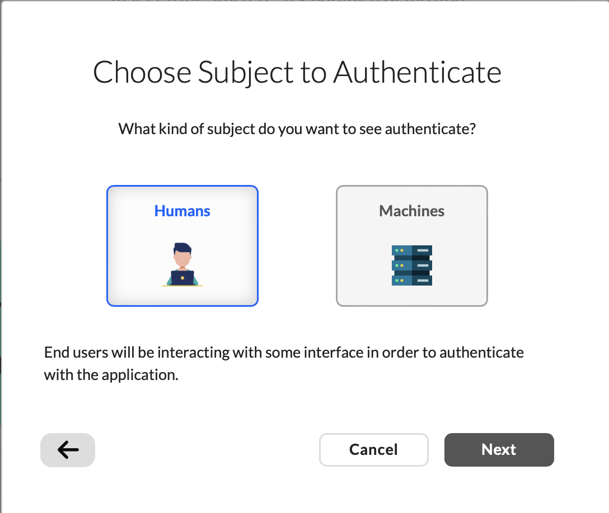
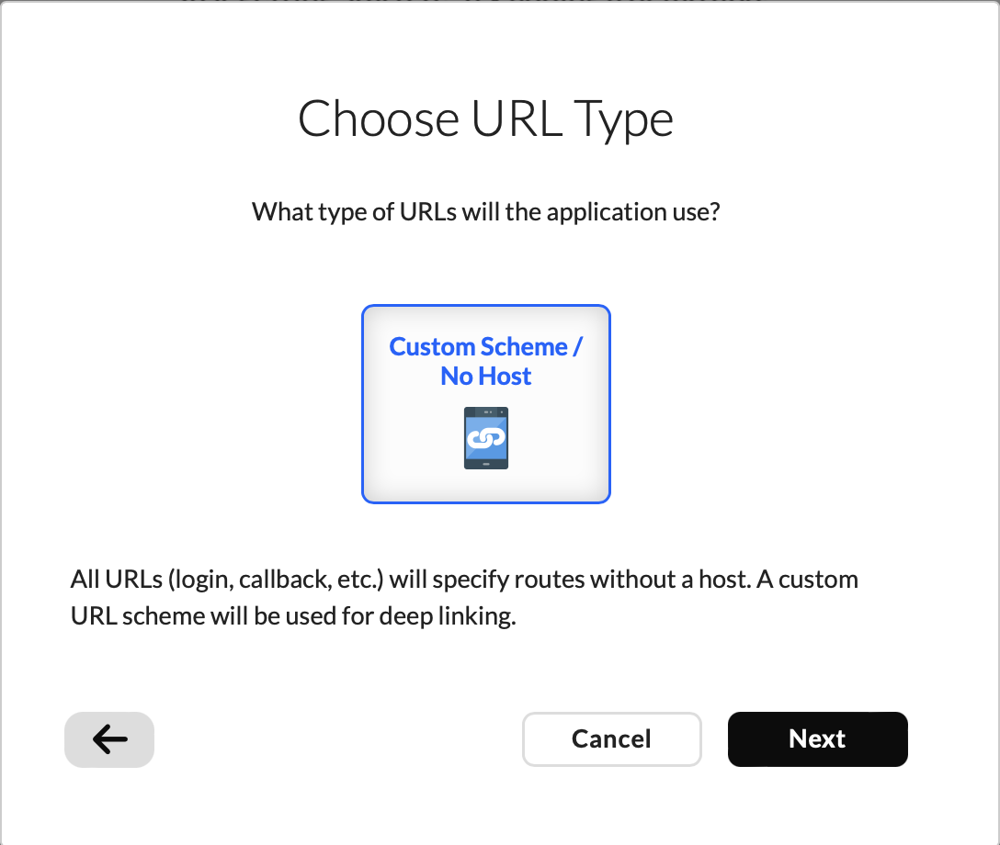
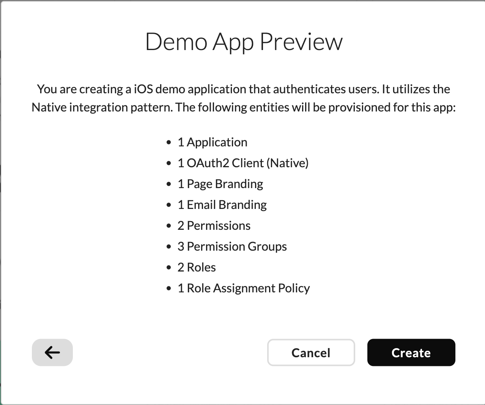
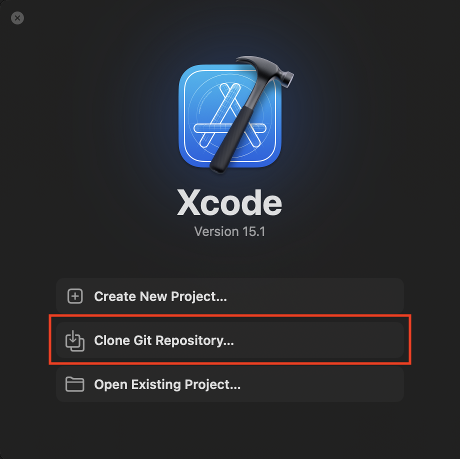
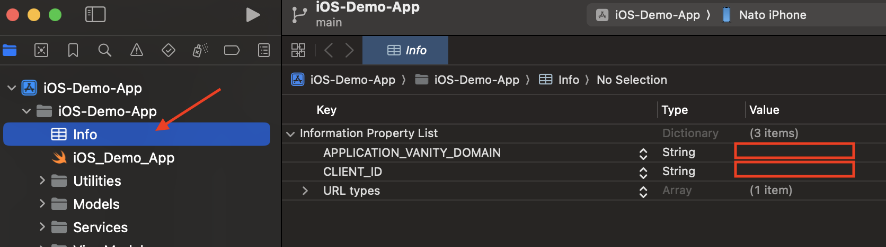

  <a href="https://wristband.dev">
    <picture>
      
    </picture>
  </a>
  

    Enterprise-ready auth that is secure by default, truly multi-tenant, and ungated for small businesses.
  

  

    <b>
      <a href="https://wristband.dev">Website</a> •
      <a href="https://docs.wristband.dev">Documentation</a>
    </b>
  

 

---

 

# Mobile Demo App Instructions

## Configure Wristband Demo App Dashboard

1. **Choose Subject to Authenticate**: Humans

 

2. **Select Client Type**: iOS

 

3. **Choose URL Type**: Custom Scheme / No Host

 

4. **Demo App Preview**: Create

 

## Clone GitHub Repo

1. **Open Xcode**  
   If you haven't yet installed Xcode, follow these instructions: [Install Xcode](https://developer.apple.com/xcode/)

2. **Clone GitHub Repository**  
   Clone the repository from the following link: [Wristband B2B iOS Demo App](https://github.com/wristband-dev/b2b-ios-demo-app.git)
   

3. **Add Values to Info.plist**  
   Add the following values to the `Info.plist` file in the navigation tree. These values can be found in the Wristband dashboard:
   - **Application Vanity Domain**: Located in application settings
   - **Client ID**: Located in OAuth2 clients

4. **Run the App**  
   - Select the play button to build the app.
   - Sign up or log in.
   - Once in the app, admins will be able to create invoices and access the admin portal to invite users.
   - All users will be able to change their profile (birthday, first name, last name, reset password, etc.).

 

## Questions

Reach out to the Wristband team at <support@wristband.dev> for any questions regarding this script.

 
